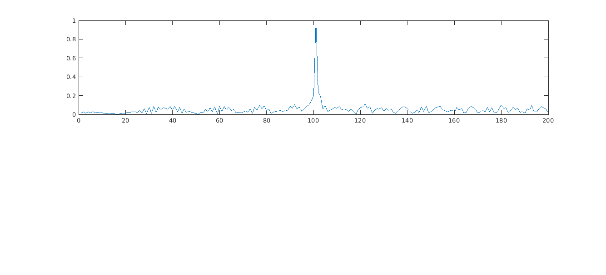
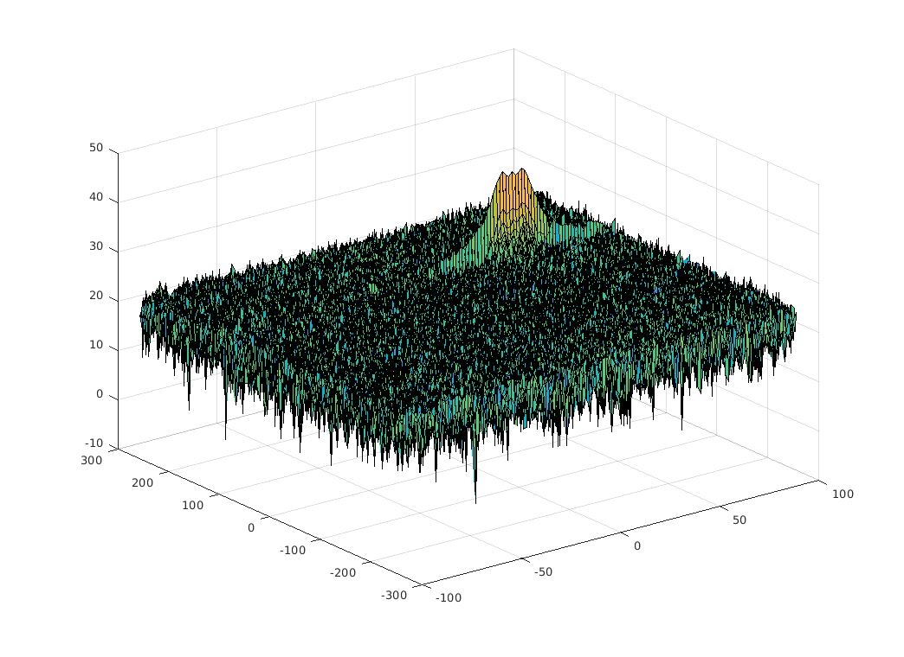
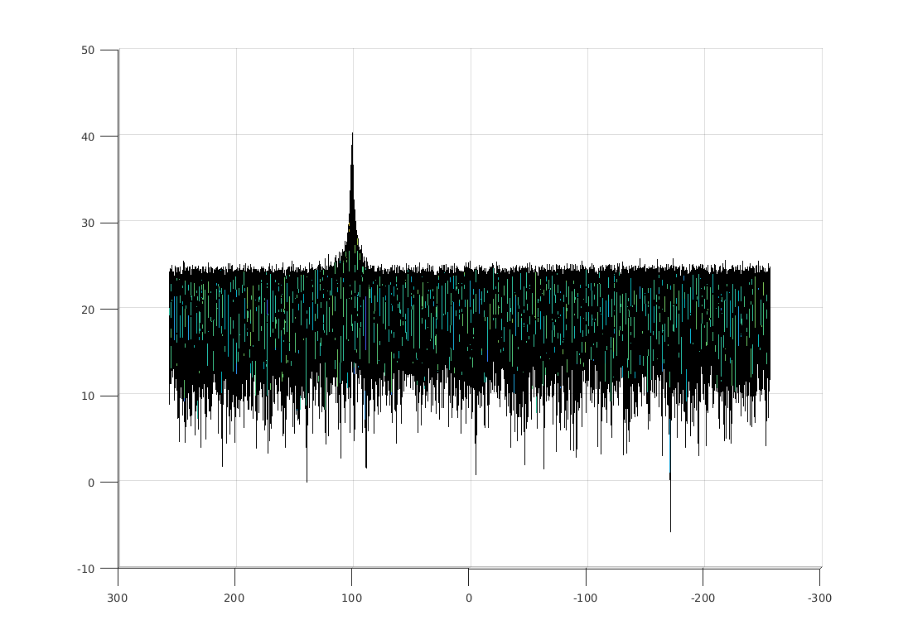
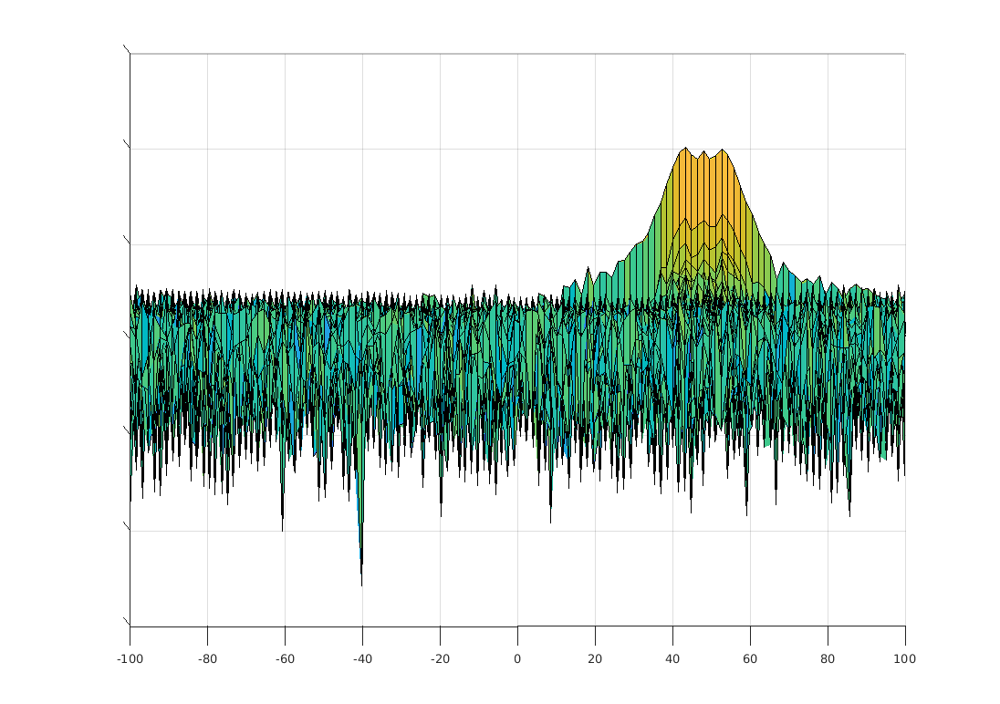
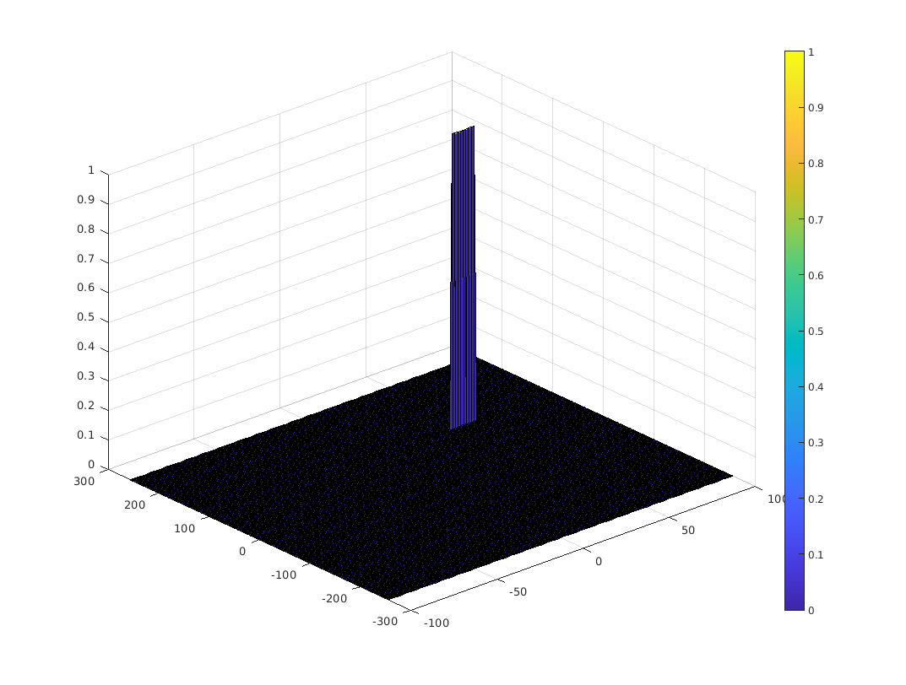
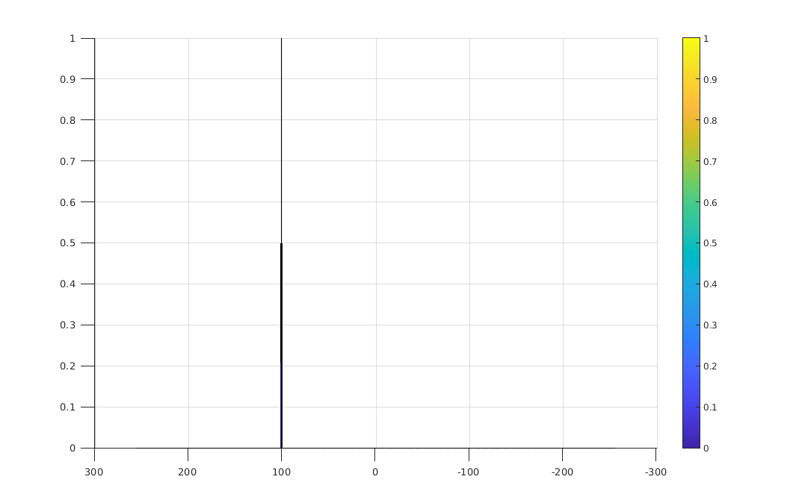
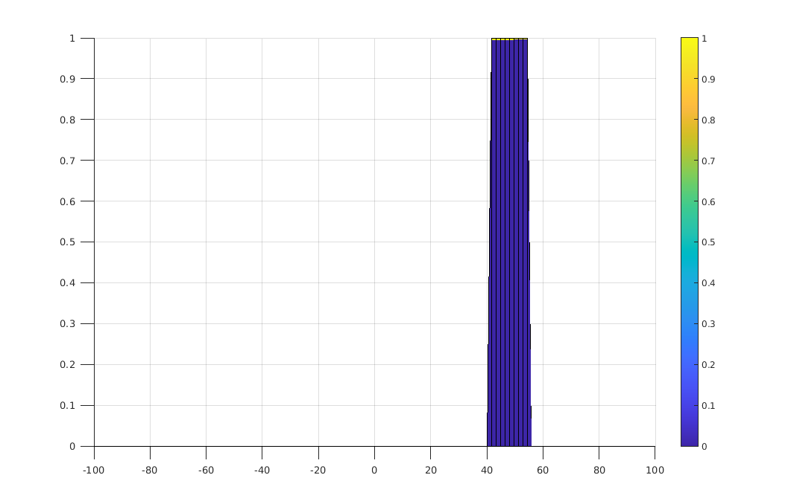

# Radar Target Generation and Detection

In this project, 2D CFAR algorithm is demostrated with simulated FMCW radar signal reflected from an object moving at constant velocity.

Before CFAR algorithm is applied, the signals has to be pre-processed by
1. Compute the element-wise product of Tx and Rx signal 1D arrays
2. Apply 2D Fourier transformation to the result of step 1 to get Range-Doppler 2D Matrix
3. Keep half of the Range-Doppler 2D Matrix and rearranges it by shifting the zero-frequency component to the center of the array and convert the matrix
4. Convert the amplitude of Range-Doppler 2D Matrix to dB


## Implementation steps for the 2D CFAR process
With the range-doppler matrix, we can apply 2D CFAR algorithm to it by looping through
(nearly) each element (as cut cell) of the Range-Doppler Matrix.
Note we need to stay away from the boundary of the matrix because each cut cell has training cells and guard cells around it.<br>
The first step is to defind the dimention of training and guard cell blocks:<br>
```
%Training Cells dimensions.
Tr = 10;
Td = 8;

%Guard Cells dimensions
Gr = 5;
Gd = 4;
```
Then we apply CFAR algorithm to each cut cell in range doppler matrix.
```
r_half = Tr+Gr;
d_half = Td+Gd;
for d = (d_half+1):(RDM_nd-d_half)
    for r = (r_half+1):(RDM_nr-r_half)
    {
        //body of CFAR algorithm
    }
```

* Loop over elements of RDM array each iteration selecting one cell to be the CUT (Cell Under Test)<br>
`for i = Tr+Gr+1 : (Nr/2)-(Gr+Tr)`<br>
`for j = Td+Gd+1 : Nd-(Gd+Td)`
* For each iteration loop over the training cells "excluding the guarding cells" to sum their values<br>
`for p = i-(Tr+Gr) : i+(Tr+Gr)`<br>
`for q = j-(Td+Gd) : j+(Td+Gd)`
* Calculate the average of the noise value<br>
`noise_level = noise_level + db2pow(RDM(p,q));`
* Convert using pow2db<br>
`th = pow2db(noise_level/(2*(Td+Gd+1)*2*(Tr+Gr+1)-(Gr*Gd)-1));`
* Add the offset value
* If the CUT is greater then the threshold replace it by `1`, else `0` <br>
and that’s all for the Implementation.

## Selection of Training, Guard cells and offset
* `Tr = 10, Td = 8` For both Range and Doppler Training Cells.
* `Gr = 5, Gd = 4` For both Range and Doppler Guard Cells.
* `offset = 1.7` the offset value.<br><br>
For the size of the training and guard cells, if the size is too big, it leads to false negative detection. If the the size is too small, it leads to false positive detection.
After a few experiment trials, the above values seem to generate good results.

## Steps taken to suppress the non-thresholded cells at the edges
To handle the calculation at the edge of range doppler matrix, the algorithm stays away from the matrix edge by the distance of the sum of training band and guard band sizes.
The distances are estimated by the following equations for row and column directions.
```
r_half = Tr+Gr;
d_half = Td+Gd;
```
When stepping throught the range doppler matrix, the algorithm starts at `d_half+1` and stops at `RDM_nd-d_half`, where `RDM_nd` is the dimension of the matrix in the column direction. Similar method is applied to the row direction. 
```
for d = (d_half+1):(RDM_nd-d_half)
    for r = (r_half+1):(RDM_nr-r_half)
````

## Output:
After thresholding the range doppler matrix with SNR of 1.57, the peak of the matrix shows that the object is at 100.69m. The speed falls in the range of 41.7 and 52.7. The averaged speed is 47.2m/s. <br><br>













